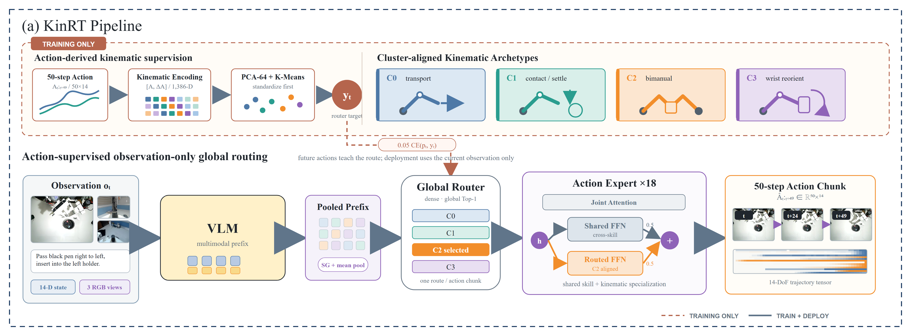

# Route by Kinematics, Act by Observation: Kinematics-Supervised Expert Routing in MoE-Augmented VLA

<div align="center">

[](https://arxiv.org/abs/2607.26807)
[](#)
[](#)
[](https://github.com/gleeacast/Route-by-Kinematics-Act-by-Observation-Kinematics-Supervised-Expert-Routing-in-MoE-Augmented-VLA)
[](LICENSES/)

**arXiv:2607.26807 [cs.RO]**

Tianhang Yang<sup>1,2,*</sup>, Yanze Zheng<sup>1,*</sup>, Junjie Wang<sup>1</sup>, Wei-Bin Kou<sup>1,&dagger;</sup>, Ruotong Li<sup>1,2</sup>, Yujiu Yang<sup>1,&dagger;</sup>

<sup>1</sup> Tsinghua Shenzhen International Graduate School, Tsinghua University<br>
<sup>2</sup> Pengcheng Lab

<sup>*</sup>Equal contribution &emsp; <sup>&dagger;</sup>Corresponding authors

</div>

---

## Why KinRT?

Mixture-of-Experts (MoE) policies can specialize different experts for different robot skills, but conventional routers learn expert assignment implicitly from visual-language observations. This is a poor match for manipulation: visually similar tasks may require very different motions, while visually different tasks may share the same kinematic structure. The signal that best distinguishes these cases, the action trajectory, is also unavailable when the policy is deployed.

**Kinematics-supervised explicit routing (KinRT)** bridges this train-deploy information gap:

- During training, KinRT encodes 50-step action trajectories and their velocities, then clusters them into four kinematically coherent archetypes.
- The cluster IDs provide explicit supervision for a global Top-1 router, so each routed expert learns a distinct motion regime.
- During deployment, the trained router predicts the kinematic archetype from the current visual-language observation and proprioceptive state only. Future actions are not required.
- The same routing method supports full-parameter and LoRA adaptation. These are parameterization choices, not separate KinRT algorithms.

KinRT is designed for cases where motion structure, rather than visual or linguistic similarity, should determine expert specialization. It adds negligible inference cost, applies across multiple VLA backbones, and preserves observation-only deployment.

<div align="center">

</div>

### Key Results

The paper evaluates eight RoboTwin tasks under clean and randomized conditions and five tasks on the real-world DIYRobot platform. Values below are average successful trials across tasks.

| Benchmark | Strongest dense baseline | KinRT | Absolute gain | Relative gain |
| --- | ---: | ---: | ---: | ---: |
| RoboTwin Clean, success out of 100 | PI0.5-LoRA: 33.1 | **KinRT-LoRA: 40.8** | +7.7 | **+23.26%** |
| RoboTwin Random, success out of 100 | PI0.5-LoRA: 34.1 | **KinRT-LoRA: 38.8** | +4.7 | **+13.78%** |
| DIYRobot, success out of 50 | PI0.5-Full: 29.6 | **KinRT-Full: 35.6** | +6.0 | **+20.27%** |

KinRT also outperforms the strongest implicit-routing MoE baseline, AdaMoE, by +8.7/+9.4 successes on RoboTwin Clean/Random and by +14.2 successes on DIYRobot. The results expose a useful adaptation trade-off: LoRA performs best in simulation, while full fine-tuning is stronger on the real platform where the embodiment gap is larger.

---

## Released Models

This repository currently releases the audited source, training configurations, evaluation integration, and reproducibility records. Model checkpoints are not included in this source release; the model links below will be activated after the public upload is complete.

| Model | Configuration | Parameterization | Checkpoint |
| --- | --- | --- | --- |
| KinRT-Full (RoboTwin) | `kinrt_full` | PI0.5 full fine-tuning | Coming soon |
| KinRT-LoRA (RoboTwin) | `kinrt_lora` | PI0.5 LoRA | Coming soon |
| KinRT-Full (DIYRobot) | `kinrt_full_diyrobot` | PI0.5 full fine-tuning | Coming soon |
| KinRT-LoRA (DIYRobot) | `kinrt_lora_diyrobot` | PI0.5 LoRA | Coming soon |

The release also retains the paper-confirmed PI0, AdaMoE, and baseline configurations. See the [paper model map](docs/PAPER_MODEL_CONFIG_MAP.md) for all 14 Table 1 entries and their evidence levels.

---

## Environment Setup

### Requirements

- Linux
- Python 3.11 or newer
- CUDA 12-compatible NVIDIA driver
- Git and Git LFS
- [`uv`](https://docs.astral.sh/uv/)
- A compatible RoboTwin 2.0 checkout for simulation evaluation
- PI0.5 or PI0 base parameters and a LeRobot-format dataset for training

Full-parameter training requires substantially more GPU memory than LoRA. The reported experiments use an effective batch size of 32; adjust device allocation and gradient accumulation together when reproducing that setting.

### Installation

```bash
git clone https://github.com/gleeacast/Route-by-Kinematics-Act-by-Observation-Kinematics-Supervised-Expert-Routing-in-MoE-Augmented-VLA.git KinRT
cd KinRT/policy/pi05

git lfs install
uv sync --frozen
uv run python -c "import jax; print(jax.devices())"
uv run python -c "import openpi; print('openpi import OK')"
```

JAX must list at least one GPU before training. The release intentionally leaves private dataset and checkpoint paths as placeholders in `src/openpi/training/config.py`; replace only the selected configuration's artifact paths.

---

## Evaluation

KinRT evaluation has three stages:

1. **Prepare artifacts** - generate kinematic router labels and normalization statistics for the selected dataset.
2. **Train and serve** - train one named KinRT configuration and start its checkpoint server.
3. **Evaluate** - run RoboTwin or DIYRobot trials while preserving the task, condition, seed, configuration, and checkpoint identity.

### Quick Start

Generate four-cluster router labels from a LeRobot dataset:

```bash
cd KinRT/policy/pi05

uv run python scripts/generate_router_labels.py \
  --repo-root /data/lerobot/my_dataset \
  --output-dir /data/lerobot/my_dataset/meta/router_labels_k4 \
  --action-horizon 50 \
  --feature-mode chunk_velocity \
  --pca-components 64 \
  --num-clusters 4 \
  --seed 0
```

After setting the dataset, label, base-weight, asset, and checkpoint paths in the selected `TrainConfig`, compute normalization statistics and train:

```bash
uv run python scripts/compute_norm_stats.py --config-name kinrt_lora
uv run python scripts/train.py kinrt_lora --exp-name kinrt_reproduction
```

For one local RoboTwin evaluation:

```bash
bash eval.sh <task_name> <task_config> kinrt_lora \
  kinrt_reproduction 0 0
```

Use `kinrt_full` instead of `kinrt_lora` to evaluate the full-parameter variant. Keep the configuration name consistent across normalization, training, serving, and evaluation.

### Evaluate RoboTwin Tasks

KinRT is evaluated on eight tasks under both clean and randomized conditions. Run 100 trials for each task-condition pair, for 1,600 trials per model in total. The release supports local evaluation and a split server/client workflow:

```bash
# Model host
bash serve_remote_model.sh deploy_policy.yml

# RoboTwin host
MODEL_SERVER_HOST=<reachable-ip> bash eval_remote.sh <task_name> 0
```

Use a separate result directory for every model, checkpoint, task, and condition. Do not mix retries from failed infrastructure runs with completed policy trials.

### Parameter Reference

| Parameter | Reported setting | Purpose |
| --- | ---: | --- |
| Action horizon | 50 | Predict one 50-step action chunk |
| Kinematic features | Action + velocity | Capture spatial configuration and motion tempo |
| PCA components | 64 | Compress trajectory features before clustering |
| Routed experts | 4 | Match the four discovered kinematic archetypes |
| Routing | Global Top-1 | Select one routed expert per action chunk |
| Router loss coefficient | 0.05 | Supervise routing without replacing the action objective |
| Balanced-sampling coefficient | 0.5 | Increase minority-archetype exposure |
| Effective batch size | 32 | Paper training setting |
| RoboTwin training steps | 10,000 | Paper simulation setting |
| DIYRobot training steps | 8,000 | Retained real-robot run setting |

### Supported Benchmarks

| Benchmark | Tasks | Training demonstrations | Evaluation protocol | Release support |
| --- | ---: | ---: | --- | --- |
| RoboTwin 2.0 | 8 | 800 total | 100 Clean + 100 Random trials per task | Policy and evaluation overlay |
| DIYRobot | 5 | 500 total | 50 real-world trials per task | Configs, conversion, serving, and hardware guide |

The full RoboTwin simulator, datasets, base checkpoints, fine-tuned checkpoints, and physical robot are external artifacts and are not bundled in this repository.

### Sampling Configurations

- Router-label generation uses KMeans with `K=4`, PCA-64 features, and seed `0` in the released command.
- Training uses balanced sampling with coefficient `0.5` to retain the empirical distribution while exposing minority archetypes.
- RoboTwin reports Clean and Random conditions separately; each average is computed from eight per-task success counts.
- DIYRobot uses five tasks and reports the average success count out of 50 trials.
- Every result must record the source revision, dataset digest, router-label digest, normalization assets, checkpoint step, seeds, and evaluation condition.

### Output Format

Training writes checkpoints under the configured checkpoint base directory and experiment name. Evaluation roots are selected through `eval_result_root` and `router_info_root` in `deploy_policy.yml`. The remote evaluator writes the following records:

```text
<eval_result_root>/<run>/
|-- _result.txt          # run header and per-episode CSV metrics
`-- episode<N>.mp4       # optional evaluation video

<router_info_root>/<episode>/
|-- prompt.txt
|-- metadata.json
`-- infer_<step>.npz     # router tensors and the policy action chunk
```

Each `_result.txt` row records the episode, seed, success flag, cumulative success count, success rate, timing, action count, step limit, and router-telemetry directory. Preserve these outputs together with the model, checkpoint, task, condition, and source revision.

### Reproduction Documentation

| Topic | Document |
| --- | --- |
| End-to-end starting point | [Getting started](docs/getting-started.html) |
| KinRT design and implementation | [Implementation reference](docs/KINRT_IMPLEMENTATION.md) |
| RoboTwin training and evaluation | [RoboTwin guide](docs/robotwin.html) |
| DIYRobot data and evaluation | [DIYRobot guide](docs/diyrobot.html) |
| HiArm setup and safety gates | [Real-robot guide](docs/real-robot.html) |
| FULL and LoRA differences | [Parameterization comparison](docs/FULL_VS_LORA.md) |
| Source provenance and release changes | [Change and source manifest](CHANGELOG_AND_SOURCE_MANIFEST.md) |

Validate the complete release before reproduction:

```bash
python tools/validate_release.py --check-manifests
```

---

## Citation

If you use KinRT, please cite:

```bibtex
@article{yang2026route,
  title={Route by Kinematics, Act by Observation: Kinematics-Supervised Expert Routing in MoE-Augmented VLA},
  author={Yang, Tianhang and Zheng, Yanze and Wang, Junjie and Kou, Wei-Bin and Li, Ruotong and Yang, Yujiu},
  journal={arXiv preprint arXiv:2607.26807},
  year={2026}
}
```

## License

This release contains components derived from projects with different permissive licenses. OpenPI-derived sources are distributed under [Apache License 2.0](LICENSES/OPENPI_LICENSE.txt), and RoboTwin-derived integration is distributed under the [MIT License](LICENSES/ROBOTWIN_LICENSE.txt). Preserve the applicable notices when redistributing or modifying individual components.
